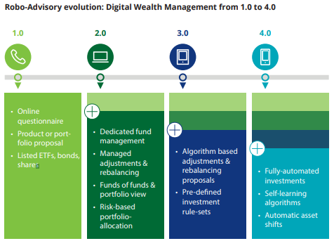

# Wealthfront-Case-Study

## Overview

Wealthfront was founded in 2011 by Andy Rachleff and Dan Carroll in Palo Alto, California. Andy Rachleff, co-founder of the VC firm Benchmark Capital, was enjoying his retirement teaching technology entrepreneurship at Stanford Graduate School of Business, funding cancer research projects with the Damon Runyon Cancer Research Foundation, and serving as Vice Chairman of the University of Pennsylvania's endowment investment committee. At Stanford, many of Andy's students would come to him looking for investment advice, but he realized he couldn't recommend the services he used because the minimums were too high. At UPenn, Andy realized successfully-managed endowments still relied on outdated and archaic tools and processes such as spreadsheets and manual calculations. After reflecting on these two realizations he arrived at the conclusion that "software could make investing easier and better for more people".

Around the same time, Dan Carroll was visiting his parents who had just been hit hard by the 2008 financial crisis. As a former trader, Dan was helping his parents assess their financials when he came across a statement from their financial advisor. Dan was disgusted at what he saw, but he understood the game.  Financial advisors make 90% of their revenue from the top 20% of their clients, so people like Dan's parents are not getting the attention they pay for. Dan realized most people don't have access to good financial advice, so he started to build a prototype solution. This prototype caught the attention of Andy Rachleff, and the two were united under their mission "to help democratize access to sophisticated financial advice". Andy and Dan agreed software was the key to achieving their mission.

Wealthfront started its journey with funding from VC firms such as Benchmark Capital, DAG Venutures, and Index Ventures, but has also received funding from individuals and hedge funds, namely Marc Andreessen, Ben Horowitz, and Tiger Global. On January 26, 2022, UBS acquired Wealthfront for $1.4 billion. Wealthfront currently manages over $28 billion for over 470,000 clients.

## The Business

As previously mentioned, Wealthfront's mission is "to help democratize access to sophisticated financial advice". Wealthfront is attacking the tradional wealth management/financial advising space, a space whose success has been built on high fees for retail investors. Historically, wealthy investors have had access to the most successful funds because they can afford the high minimums which is another issue at the heart of Wealthfront's attack. In the face of these issues, Wealthfront looks to serve unsophisticated retail investors who are not super wealthy and who don't have the time to manage their own investments on a daily basis. Wealthfront is targeting an incredibly large market that is only getting larger. Anyone with a little bit of free cash flow can become a retail investor, and currently, retail investors account for roughly 20% of stock market activity in the US. Thanks to companies like Wealthfront, who offer a retail investing platform with a minimum initial investment of $500 and charge a low 0.25% annual advisory fee, the number of retail investors is only going to rise with the increasingly present digital world democratizing finance.

Wealthfront can manage retail investors' money at 1/8th the cost of traditional financial advisors by using machine learning software. These cost savings allow Wealthfront to "pool client funds and replicate the account size needed for private wealth management services", which allows the company to provide their investors with access to tax loss harvesting and direct indexing strategies, which are more savvy techniques traditionally reserved for high net worth investors. Software, and the scale it provides, is Wealthfront's competive advantage.  Automated software enables Wealthfront to offer investors completely customizable and diversified portfolios that rebalance on their own and minimize taxes. The tax savings generated by Wealthfront portfolios has paid for 96% of their clients' advisory fees. The machine learning software behind it all "is composed of services discovered via ZooKeeper communicating over HTTP RPC (usually serialized to JSON) and implemented in Java using Hibernate on top of MySQL" (Kevin Peterson, Software Engineer at Wealthfront).

## The Competitive Landscape

Wealthfront operates in the robo-advisor domain of financial technology. Robo-advisors empower more individuals to save, invest, and work towards financial freedom by providing more accessible money management options at a fraction of the cost historically offered by traditional wealth management firms. Apart from Wealthfront, some of the other major firms operating in the robo-advisor space include SoFi, Betterment, E*TRADE, and Axos. spaceDeloitte buckets the evolution of the robo-advsing domain into 4 distinct iterations.

The first iteration of robo-advisors used client questionnaires to propose single products or portfolio allocations based on listed investment products such as stocks, bonds, and ETFs. Most of these firms operate via the web or smartphone apps and lack execution managed by bank or broker API. Clients have to manage their portfolios and accounts on their own.

The second interation used client questionnaires to filter suitable investment products as well as filter a handful of pre-defined risk-allocated portfolios. This service curates portfolios as a fund of funds and provides direct order execution. Dedicated investment managers handle investing and portfolio adjustements as well as oversee the investment algorithm and define rule sets.

In the third iteration, algorithms, which monitor and satisfy pre-defined investment strategies, are responsible for investment decisions and portfolio rebalancing proposals. Professional fund managers provide final oversight, and some services enable their users to approve proposed portfolio adjustment decisions to increase individual customization.

The fourth iteration, Wealthfront's current model, is characterized by direct ivestments via self-learning artificial intelligence investment algorithms that are built upon sophisticated risk managment and profiling questionnaires. These algorithms automatically shift investments based on changing market conditions and consumer preferences related to profit, risk appetite, and liquidity. Client portfolios are monitored and adjusted in real time to keep on track with a selected investment strategy.

## Wealthfront's Results