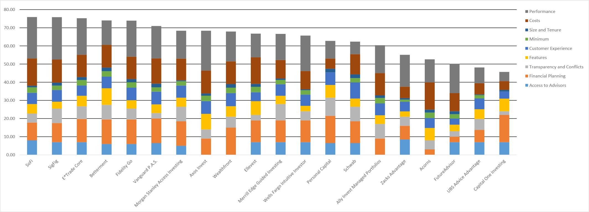

# Wealthfront-Case-Study

## Overview

Wealthfront was founded in 2011 by Andy Rachleff and Dan Carroll in Palo Alto, California. [^1] Andy Rachleff, co-founder of the VC firm Benchmark Capital, was enjoying his retirement teaching technology entrepreneurship at Stanford Graduate School of Business, funding cancer research projects with the Damon Runyon Cancer Research Foundation, and serving as Vice Chairman of the University of Pennsylvania's endowment investment committee. At Stanford, many of Andy's students would come to him looking for investment advice, but he realized he couldn't recommend the services he used because the minimums were too high. At UPenn, Andy realized successfully-managed endowments still relied on outdated and archaic tools and processes such as spreadsheets and manual calculations. After reflecting on these two realizations he arrived at the conclusion that "software could make investing easier and better for more people". [^2]

Around the same time, Dan Carroll was visiting his parents who had just been hit hard by the 2008 financial crisis. As a former trader, Dan was helping his parents assess their financials when he came across a statement from their financial advisor. Dan was disgusted at what he saw, but he understood the game.  Financial advisors make 90% of their revenue from the top 20% of their clients, so people like Dan's parents are not getting the attention they pay for. Dan realized most people don't have access to good financial advice, so he started to build a prototype solution. This prototype caught the attention of Andy Rachleff, and the two were united under their mission "to help democratize access to sophisticated financial advice". Andy and Dan agreed software was the key to achieving their mission. [^2]

Wealthfront started its journey with funding from VC firms such as Benchmark Capital, DAG Venutures, and Index Ventures, but has also received funding from individuals and hedge funds, namely Marc Andreessen, Ben Horowitz, and Tiger Global. On January 26, 2022, UBS acquired Wealthfront for $1.4 billion. Wealthfront currently manages over $28 billion for over 470,000 clients. [^3]

## The Business

As previously mentioned, Wealthfront's mission is "to help democratize access to sophisticated financial advice". Wealthfront is attacking the traditional wealth management/financial advising space, a space whose success has been built on high fees for retail investors. Historically, wealthy investors have had access to the most successful funds because they can afford the high minimums which is another issue at the heart of Wealthfront's attack. In the face of these issues, Wealthfront looks to serve unsophisticated retail investors who are not super wealthy and who don't have the time to manage their own investments on a daily basis. Wealthfront is targeting an incredibly large market that is only getting larger. Anyone with a little bit of free cash flow can become a retail investor, and currently, retail investors account for roughly 20% of stock market activity in the US. [^4] Thanks to companies like Wealthfront, who offer a retail investing platform with a minimum initial investment of $500 and charge a low 0.25% annual advisory fee, the number of retail investors is only going to rise with the increasingly present digital world democratizing finance.

Wealthfront can manage retail investors' money at 1/8th the cost of traditional financial advisors by using machine learning software. [^5] These cost savings allow Wealthfront to "pool client funds and replicate the account size needed for private wealth management services", which allows the company to provide their investors with access to tax loss harvesting and direct indexing strategies, which are more savvy techniques traditionally reserved for high net worth investors. Software, and the scale it provides, is Wealthfront's competive advantage.  Automated software enables Wealthfront to offer investors completely customizable and diversified portfolios that rebalance on their own and minimize taxes. The tax savings generated by Wealthfront's portfolios has paid for 96% of their clients' advisory fees. [^6] The machine learning software behind it all "is composed of services discovered via ZooKeeper communicating over HTTP RPC (usually serialized to JSON) and implemented in Java using Hibernate on top of MySQL" (Kevin Peterson, Software Engineer at Wealthfront).

## The Competitive Landscape

Wealthfront operates in the robo-advisor domain of financial technology. Robo-advisors empower more individuals to save, invest, and work towards financial freedom by providing more accessible money management options at a fraction of the cost historically offered by traditional wealth management firms. Apart from Wealthfront, some of the other major firms operating in the robo-advisor space include **[SoFi](https://www.sofi.com/invest/)**, **[Betterment](https://www.betterment.com/)**, **[E*TRADE](https://us.etrade.com/what-we-offer/our-accounts/core-portfolios)**, and **[Axos](https://www.axos.com/invest)**. **[Deloitte](https://www2.deloitte.com/content/dam/Deloitte/de/Documents/financial-services/Deloitte-Robo-safe.pdf)** buckets the evolution of the robo-advisor domain into 4 distinct iterations.

The first iteration of robo-advisors uses client questionnaires to propose single products or portfolio allocations based on listed investment products such as stocks, bonds, and ETFs. Most of these firms operate via the web or smartphone apps and lack execution managed by bank or broker API. Clients have to manage their portfolios and accounts on their own.

The second interation uses client questionnaires to filter suitable investment products as well as filter a handful of pre-defined risk-allocated portfolios. This service curates portfolios as a fund of funds and provides direct order execution. Dedicated investment managers handle investing and portfolio adjustements as well as oversee the investment algorithm and define rule sets.

In the third iteration, algorithms, which monitor and satisfy pre-defined investment strategies, are responsible for investment decisions and portfolio rebalancing proposals. Professional fund managers provide final oversight, and some services enable their users to approve proposed portfolio adjustment decisions to increase individual customization.

The fourth iteration, Wealthfront's current model, is characterized by direct ivestments via self-learning artificial intelligence investment algorithms that are built on sophisticated risk management and profiling questionnaires. These algorithms automatically shift investments based on changing market conditions and consumer preferences related to profit, risk appetite, and liquidity. Client portfolios are monitored and adjusted in real time to keep on track with a selected investment strategy.

(Source: [Deloitte](https://www2.deloitte.com/content/dam/Deloitte/de/Documents/financial-services/Deloitte-Robo-safe.pdf))

## Wealthfront's Results

The number one metric used to measure success in the robo-advisor space is assets under management, where Wealthfront ranks 4th with $21.4 billion. [^7] However, combining qualititave and quantitative metrics such as performance, costs, size and tenure, account minimums, customer experience, features, transparency and conflicts, financial planning, and access to human advisors paints a better picture when comparing different robo-advisors. Across all of these metrics, Backend Benchmarking ranks Wealthfront 9th out of the top 20 robo-advisor platforms. Wealthfront's lack of a human advisor feature is a big reason they are in the middle of the pack.

**Robo-Advisor Ranking Chart**

(Source: [Backend Benchmarking](https://www.backendbenchmarking.com/blog/2021/08/the-robo-ranking-best-overall-robo/))

Many robo-advisor platforms are putting performance benchmarks aside and measuring success based on how well they help their clients achieve their financial goals. Wealthfront's biggest impact to the space is their position as a leader in the shift towards financial planning. Whether it's a Roth IRA or a 529 college savings plan, financial planning is where Wealthfront shines above the rest of the industry. Path and Autopilot are two tools to easily manage your financial life once you link your outside financial accounts to Wealthfront. [^8] Path "creates a birds-eye view of your current financial situation, based on your income and expenses, and then helps you meet your savings goals". Path also allows users to see the financial impact of different decisions on their goals such as taking time off to travel. Autopilot assists users in the day to day management of their money. Autopilot "automatically distributes your paycheck to different financial accounts, from your checking account to an emergency fund and your investment accounts, to meet all your different needs and goals".  Whether it's planning for the future or planning for now, Wealthfront beats out the rest of the market. It's because of Wealthfront's financial planning prowess that they are Forbes' best robo-advisor for financial planning [^8] and Investopedia's best overall robo-advisor. [^9]

## My Recommendations

I have two primary recommendations for Wealthfront to further establish themselves in the robo-advisor domain. The first is to add a human advisor feature. Unsophisticated investors may feel better knowing they can speak with a human about their investment and financial planning options before making these important decisions. A human advisor feature may also better attract older retail investors who are used to speaking with human advisors about their financial goals, but who are ready to move to a lower cost robo-advisor platform. My second recommendation is for Wealthfront to add the ability to trade fractional shares. The ability to trade fractional shares provides investors increased cash and cost efficiencies. Wealthfront could develop algorithms to compile fractional trades and execute them as whole unit trades. [^10] This should be realitively easy and low cost for Wealthfront to implement considering much of their success lies in their advanced algorithms. Adding these two features would eliminate their major shortcomings and propel Wealthfront to the top of the robo-advisor space.

## Sources

[^1]: [Crunchbase](https://www.crunchbase.com/organization/wealthfront)
[^2]: [Wealthfront: Origin](https://www.wealthfront.com/origin) 
[^3]: [Financial Samurai](https://www.financialsamurai.com/is-wealthfront-running-out-of-money/)
[^4]: [Bloomberg](https://www.bloomberg.com/news/articles/2021-11-17/retail-traders-retreat-as-choppy-markets-challenge-easy-profits)
[^5]: [Harvard Business School](https://digital.hbs.edu/platform-rctom/submission/wealthfront-why-automated-advising-and-millennials-were-made-for-each-other/)
[^6]: [Wealthfront: Pricing](https://www.wealthfront.com/pricing)
[^7]: [Forbes: AUM](https://www.forbes.com/advisor/investing/top-robo-advisors-by-aum/)
[^8]: [Forbes: Robo-Advisors](https://www.forbes.com/advisor/investing/best-robo-advisors/)
[^9]: [Investopedia](https://www.investopedia.com/best-robo-advisors-4693125)
[^10]: [ETNA](https://www.etnasoft.com/fractional-shares/)

